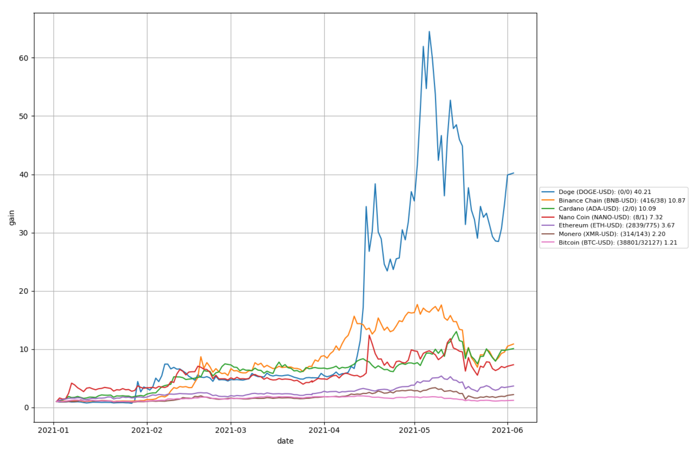

# stocktool
A tool for analyzing stock

## Features
-   Download and update stock data
-   Plot stock gain for time period
-   Output resampled stock data



## Gettin Started

```
pip install -r requirements.txt
python main.py download
python main.py plot
```

# Usage

The stocktool allows subcommands for performing different functions

## Plot stock gain

```
python main.py plot
```

You can use the following flags:

-   -s: start date in the format (yyyy/mm/dd)
-   -e: end date in the format (yyyy/mm/dd)
-   -t: list of tickers
-   -g: group

Example:

```
python main.py plot -g crypto
```


## Downlaod stock data

It will use the tickers specified in the `ticker_data.csv` file to downlaod stock data

```
python main.py download
```

You can use the following flags:

-   -s: start date in the format (yyyy/mm/dd)
-   -e: end date in the format (yyyy/mm/dd)
-   -t: list of tickers
-   -f: force download even if data exists

## Update stock data

It will update the stock data to the latest date.  
It will not update existing data which may change due to stock splits. Use force download for that.  

You can use the following flags:

-   -t: list of tickers

```
python main.py update
```

## Output stock data to csv

```
python main.py output
```

You can use the following flags:

-   -s: start date in the format (yyyy/mm/dd)
-   -e: end date in the format (yyyy/mm/dd)
-   -t: list of tickers
-   -r: resample string (d or m or y)
-   -f: output file path